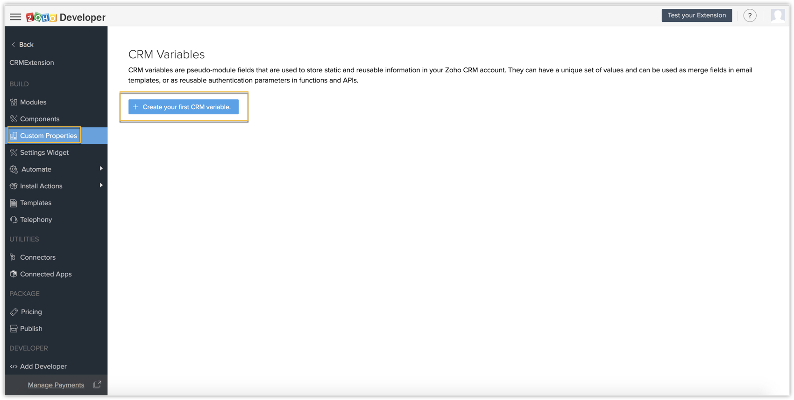
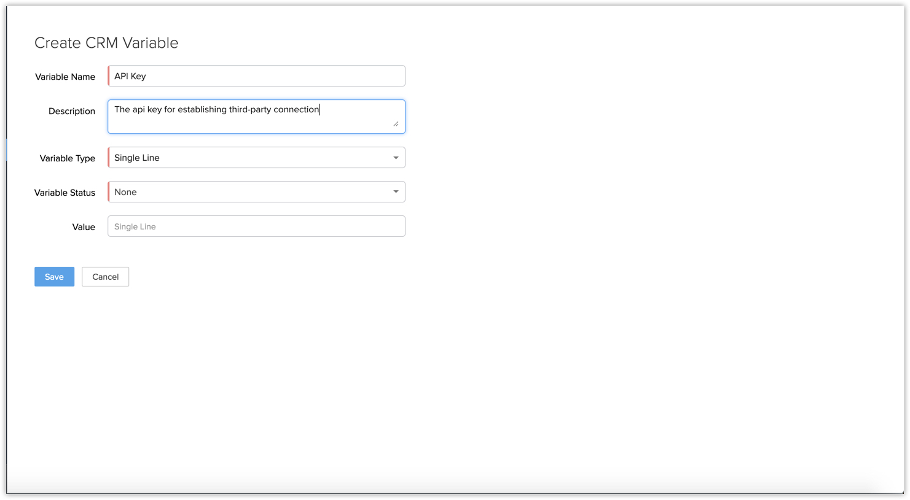
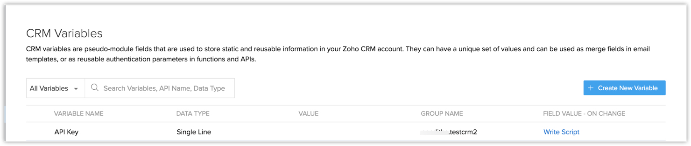
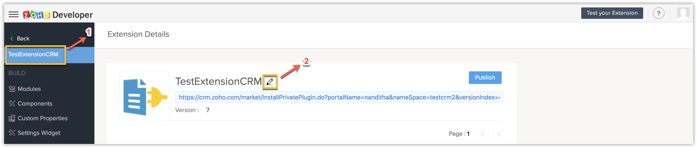
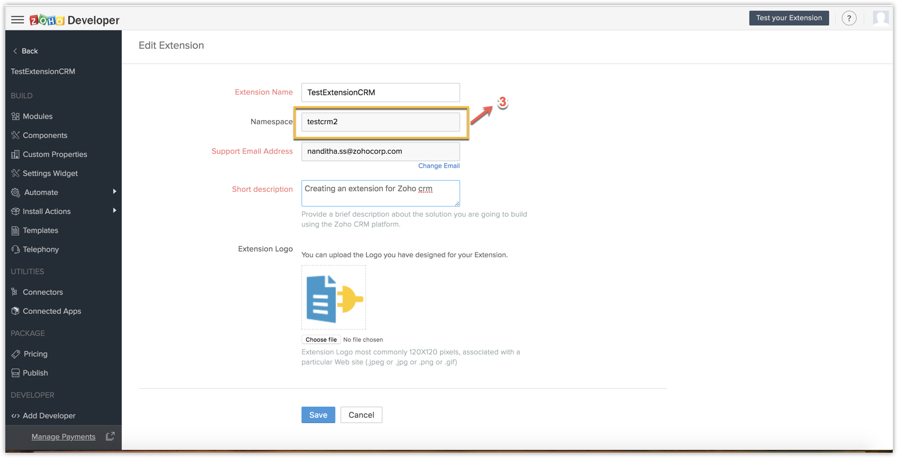
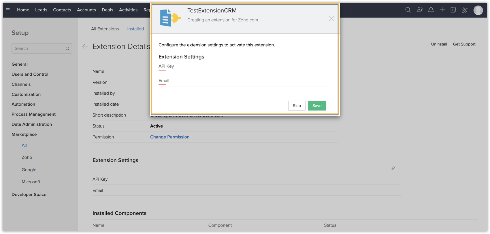

# Custom Variables for third-party integrations
Custom variables store static information in your CRM. They are global variables that can be used in place of certain important fields in CRM to help users easily make personalized changes.

## How to create a Custom Variable

- 1. Choose `Custom Properties` from the left panel of the Zoho Developer console under *Build*, and then click `Create your first CRM variable`.



- 2. Enter the necessary details and click `Save`. The value field is currently left empty for the users to later enter the value when prompted during the *installation of the extension*.



- 3. The custom variable is created. The system also creates a unique API name for the custom variable in the following format `"extensionNameSpace__VariableName"`. The system creates a unique API name by appending the extension name as a prefix. In our example, `"API Key"` is the custom variable created to hold the API key. `"testcrm2__API_Key"` is the unique API name provided by the system where *"testcrm2"* is the extension's unique namespace.



> Note: You can obtain the extension's NameSpace from the Extension Details page.





## 1 . Set Organization Variable 

This is used to *set* the value of the custom variable.

**Syntax:**

```Deluge
<Response> = zoho.crm.invokeConnector("crm.set", <valueMap Map>);
```
**Example:**

```Deluge

valueMap = Map();


valueMap.put("apiname","testcrm2__API_Key");
valueMap.put("value","{your API key token}");

resp = zoho.crm.invokeConnector("crm.set",valueMap);

```

where,
- `<Response>` is the response details regarding the success or failure of updating.
- `<valueMap Map>` is the map containing the key value pair denoting the API name of the custom variable to be updated, and the value with which the custom variable should be updated.

## 2. Get Organization Variable


This is used to fetch the value of the custom variable.

**Syntax :**

```Deluge
<Response> = zoho.crm.getOrgVariable("<customVariableName>");
```
**Example:**

```Deluge

value = zoho.crm.getOrgVariable("testcrm2__API_Key");

info "The value of the custom variable, apikey, is " + value;

```

where,
- `<Response>` returns the value of the custom variable.
- `<customVariableName>` is the API name of the custom variable.


When the extension is installed in a Zoho CRM account, the user is prompted for the Custom Variables we have created .

