# WebHook
## invokeURL task for API calls
- `step 1:` Select Module and Create a button.

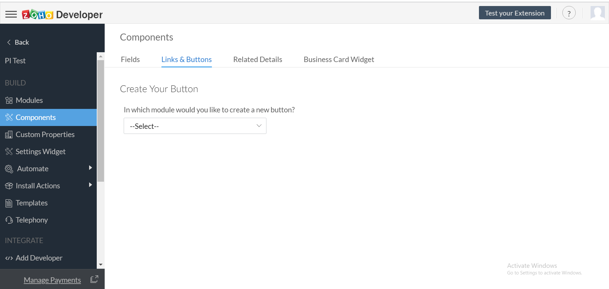
- `step 2:` Fill out the form and select "`Writing 
Function`".

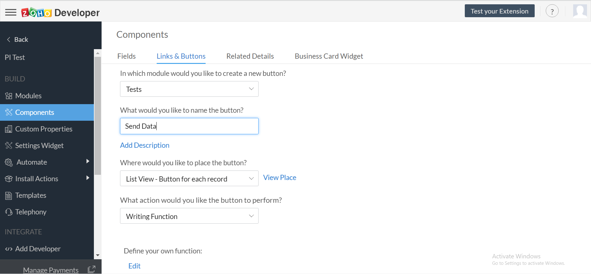
- `step 3:` Click "`Edit`" and a Deluge Editor will be Opened.

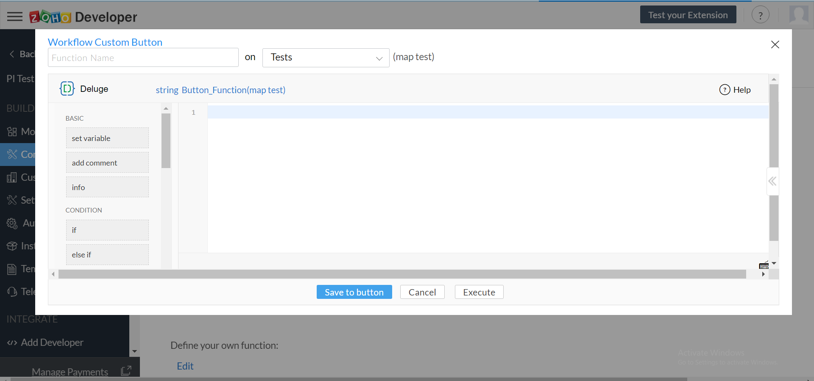

- `step 4:` Enter the function name and map the function to the module of your choice.

> Go to Reference Articles to view all articles about `Deluge` and `Zoho CRM`

**Example :**
Create a Function to send Data to the Third Party Application through Web hook and Update a Field in our module Depending upon the Response returned by Web hook

### Deluge Script Break Down

- How to get Id of Records in your module :
    
    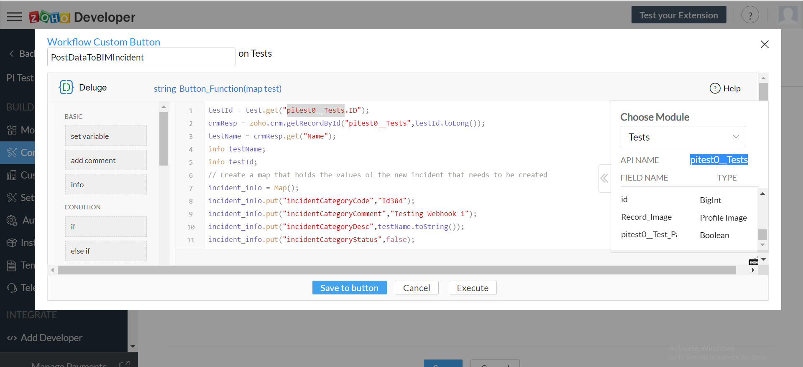

    > In the above picture we can see the `Side Toggle Bar` with `APINames` and `FieldNames` of every module. Make sure you give the exact name while using it in the Deluge Script.

    ```Deluge
    testId = test.get("pitest0__Tests.ID");
    info testId;

    crmResp = zoho.crm.getRecordById("pitest0__Tests",testId.toLong());
    testName = crmResp.get("Name");
    info testName; 
    ```
    on executing the above script we can get all details of Record coresponding to the Id given.

- Webhook or invoke a URL in Deluge

    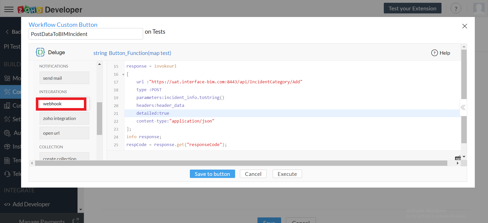

    - Drag and drop the Webhook Component from the Deluge Side Bar.
    - Enter the Required Details - Headers and Parameters can be Given as a mapped variable
    in `Key-Value` format.
    - Execute the Script before Saving, While Executing Give an Id as paramater.
    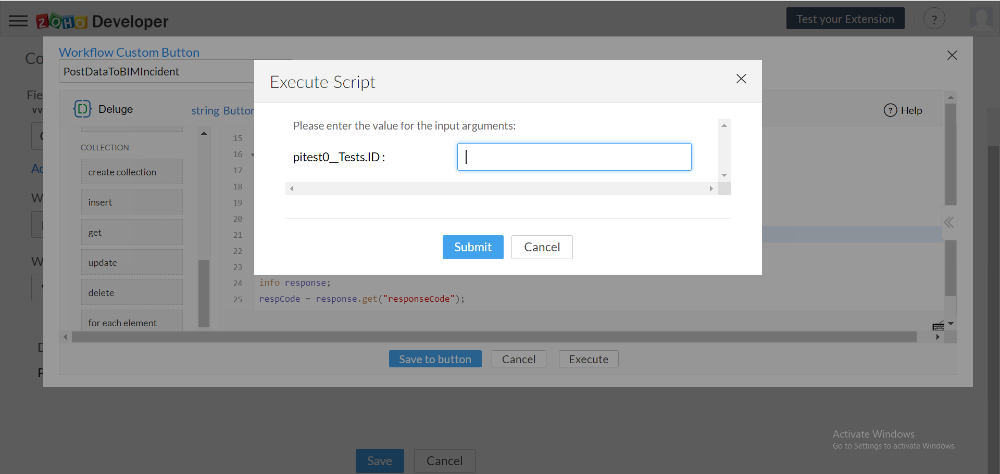

        To Get the Id - Click `Test your Extension` ,Which will open a Sandbox environment page.
    select a record and the URL contains the Records ID.

        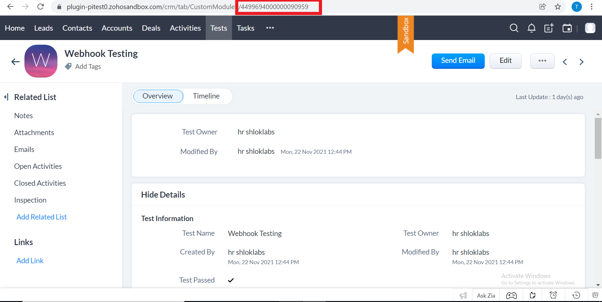
    - At last Save the function.

The whole Script Looks like this:

```Deluge

// To get ID and Details of the Record coresponding to the Id
testId = test.get("pitest0__Tests.ID");
crmResp = zoho.crm.getRecordById("pitest0__Tests",testId.toLong());
testName = crmResp.get("Name");

// Create a map that holds the values (Paramater to send while invoking the URL)

incident_info = Map();
incident_info.put("incidentCategoryCode","Id384");
incident_info.put("incidentCategoryComment","Testing Webhook 1");
incident_info.put("incidentCategoryDesc",testName.toString());
incident_info.put("incidentCategoryStatus",false);

// Create a map variable to hold the headers that is required by Authentication

header_data = Map();
header_data.put("Authorization","Your Token");

// Webhook
response = invokeurl
[
	url :"https://uat.interface-bim.com:8443/api/IncidentCategory/Add"
	type :POST
	parameters:incident_info.toString()
	headers:header_data
	detailed:true
	content-type:"application/json"
];
info response;

//The success response will be returned when the <detailed> param is set to true like above code.Store that in variable.

respCode = response.get("responseCode");
info respCode;

//if the success response satisfies the bellow condition , the field value of the specified record will be updated
if(response.get("responseCode") == 200)
{
	mapp = Map();
	mapp.put("pitest0__Test_Passed",true);
	result = zoho.crm.updateRecord("pitest0__Tests",testId.toString(),mapp);
}
return "";

```

- `step 5:` Click `Test your Extension` , go to the module where you have added a Button and in the Listing view we can see our newly created button.
Clicking the button will invoke the button function where we have added our Web hook.

    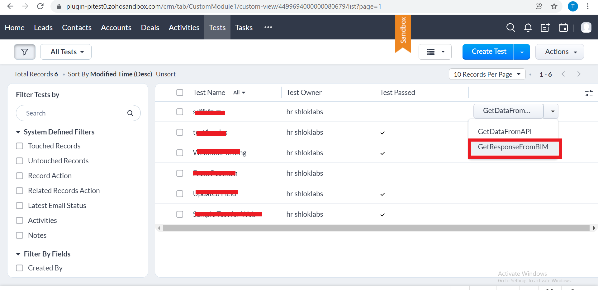

## Create Records with API V2 using Postman :

- `step 1 :` Go to https://api-console.zoho.com/ and login to your account.

- `step 2 :` Click `Add Client` and choose **`Self Client`**.
    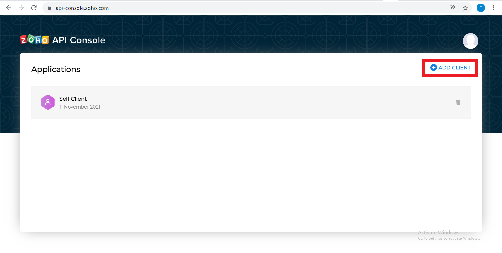

- `step 3 :` Open **`Self Client`** and Enter Scope (Enter `ZohoCRM.modules.ALL`), Duration, Description.
    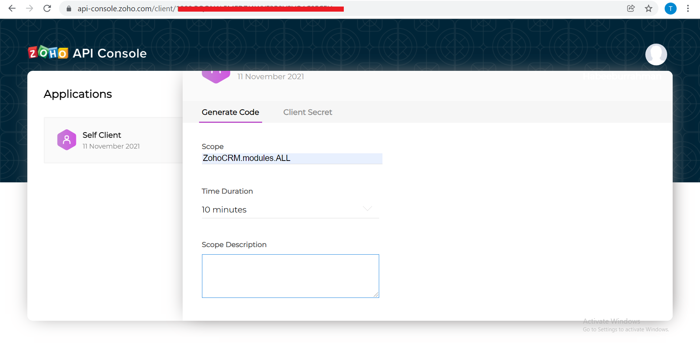

- `step 4 :` Hit `Create`, now select portal(`CRM`).
    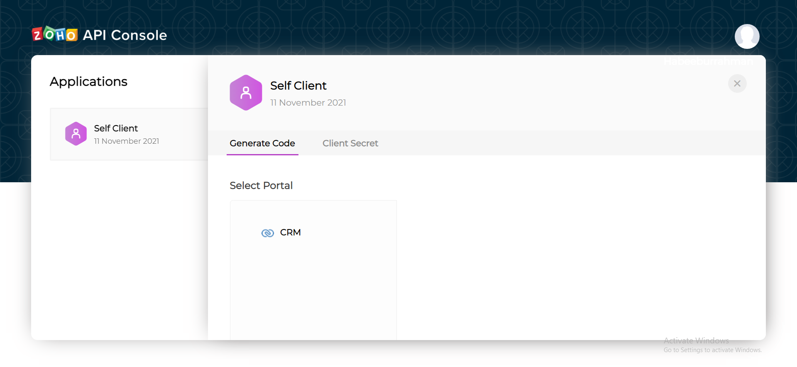

    Now Select the Organisation.
    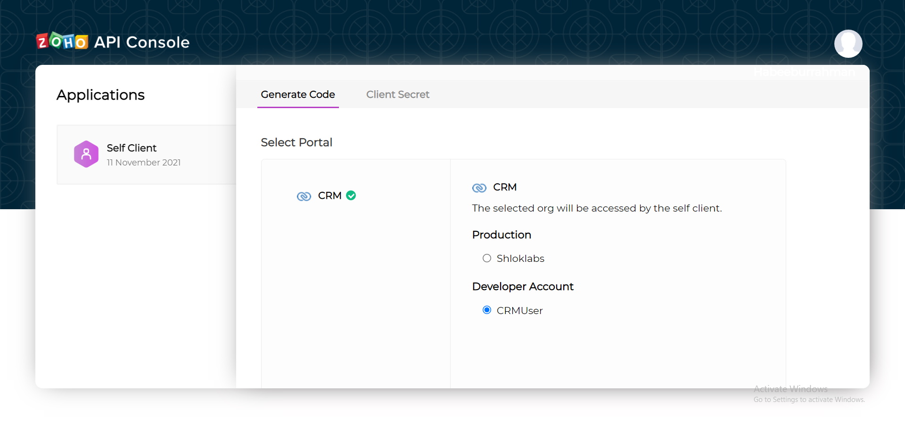

    A window with Code will be pop up, Copy and store it 
    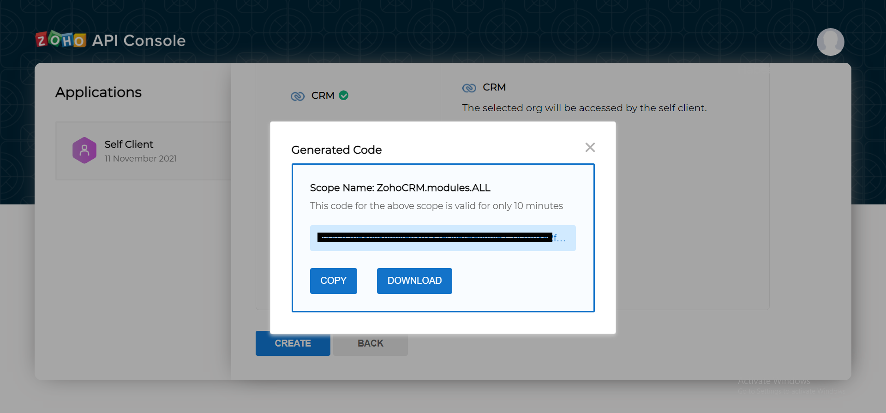

- `step 5 :` Now go to `Client Secret` tab and copy
`client_id` & `client_secret`.

    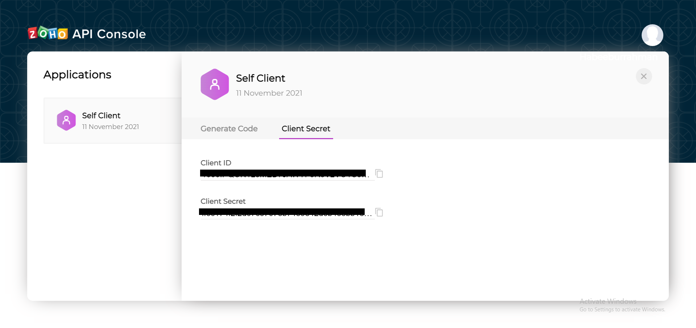

- `step 6 :` Go to `POSTMAN` application and Create a `POST` request with url - https://accounts.zoho.com/oauth/v2/token.

    - Go to `Headers` and add **ContentType** as shown below:

        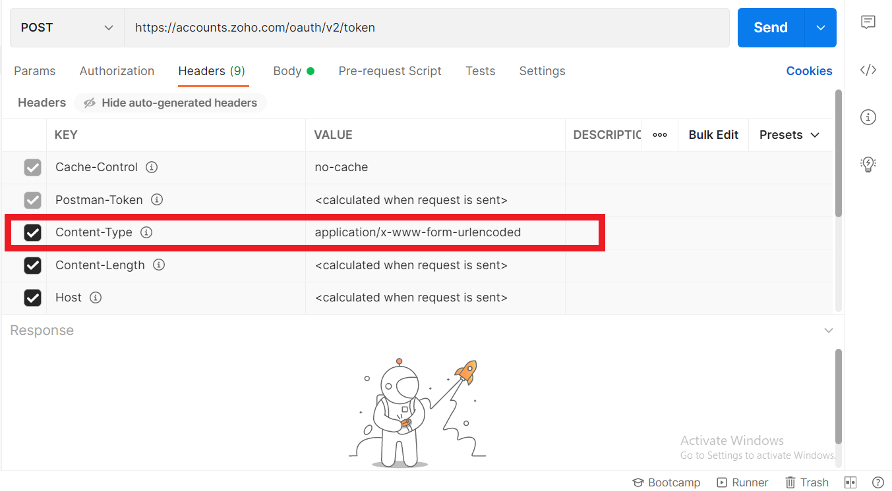
    
    - Go to `Body` and add the details as shown below:

        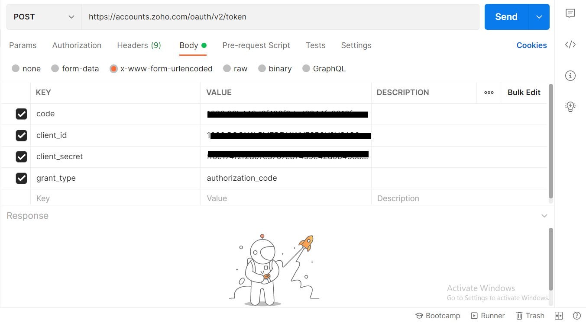
    
    - Hit Send , we will get the `Refresh & Access Token`.

        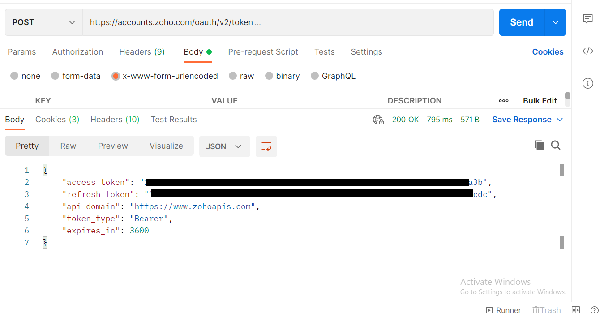

- `step 7 :` Create another POST request and paste the Refresh Token from the previous request and other details as shown below along with headers as we done earlier.
Make sure to change the `grant_type` from **authorization_code** to **refresh_token** and hit `Send`.

    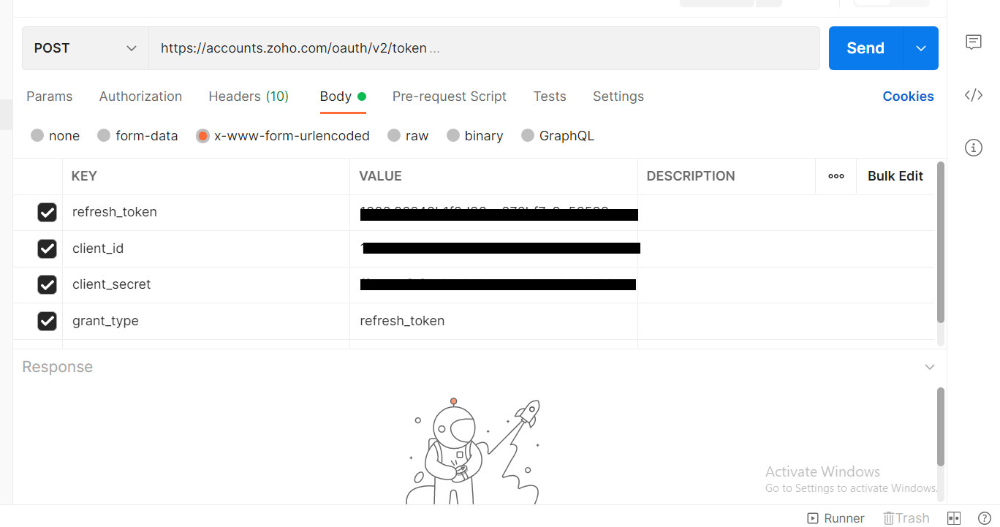

    - We will get another `Refresh Token`, copy and store it.
        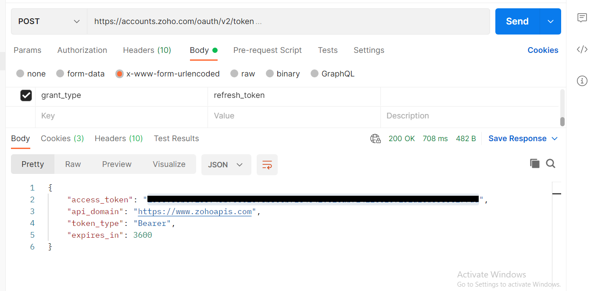

- `step 8 :` Now We have a refresh token , Create any Http request methods to access the ZOHO API.

**Example :**

### 1. GET Records from CRM Module:
    
- Create Get method and paste the url of your Extension.
Also take the Refresh token from previous request and add it to headers as shown below. Add "`Zoho-oauthtoken`" and append the token to it in the value box.

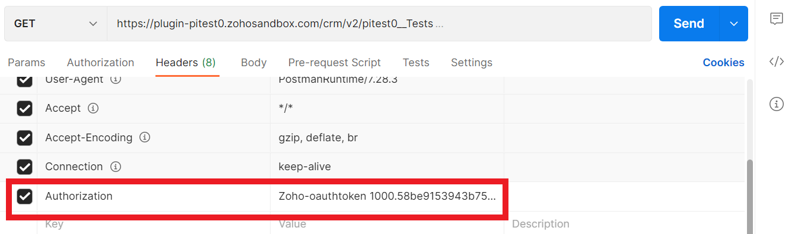

On hitting send we get the following response:

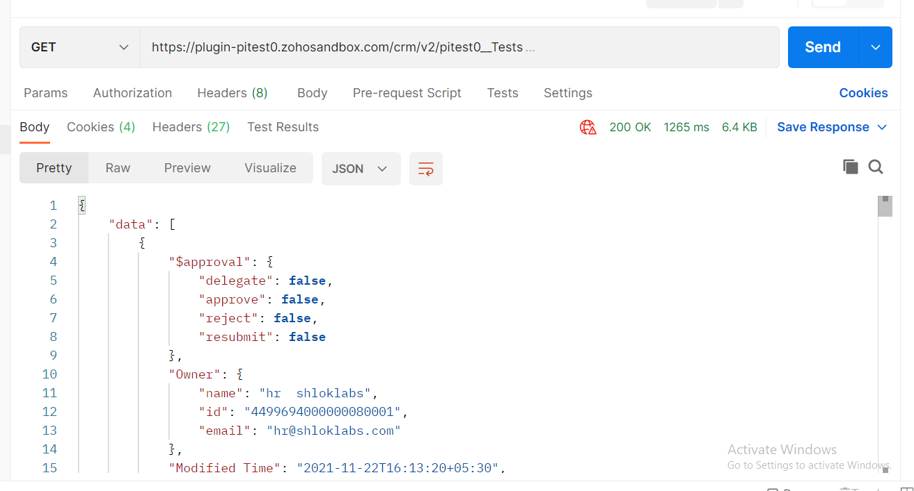

The Response is all the records of the Module Requested.

### 2. POST Records to CRM Module:

- Create Post method and Paste URL,Authentication as same as shown above.
Now go to `body` , select `raw` and Enter the data to be inserted in the format shown below:

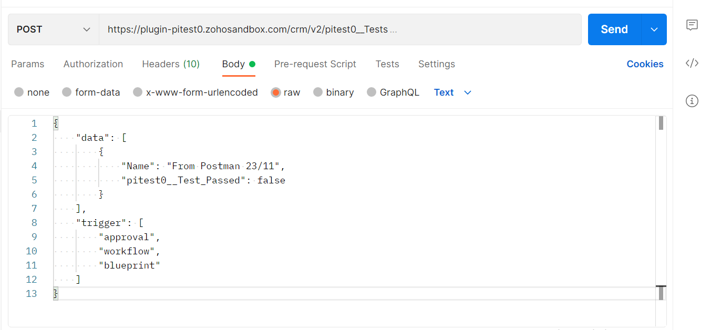

- A maximum of 100 records can be inserted per API call.

- You must use only Field API names in the input. You can obtain the field API names from:

    - [Fields metadata API](https://www.zoho.com/crm/developer/docs/api/v2/field-meta.html) (the value for the key “api_name” for every field). (Or)

    - Setup > Developer Space > APIs > API Names > {{Module}}. Choose “Fields” from the “Filter By” drop-down.

- The trigger input can be workflow, approval, or blueprint. If "trigger" is not mentioned, the workflows, approvals and blueprints related to the API will get executed. Enter the trigger value as [] to not execute the workflows.

On executing the request we get the following Response:

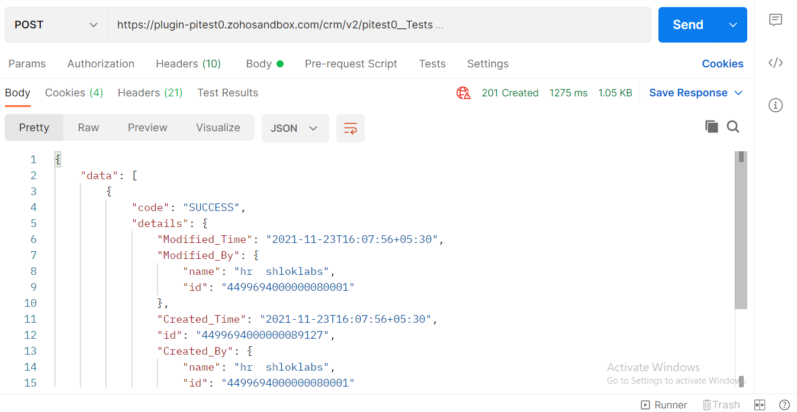

> Reference Articles

### Deluge
- [Learn Deluge](https://deluge.zoho.com/learndeluge#Welcome!)

- [Zoho CRM integration tasks by Deluge](https://www.zoho.com/deluge/help/crm-tasks.html)

### WebHooks
- [invokeURL task for API calls](https://www.zoho.com/deluge/help/webhook/invokeurl-api-task.html)

### Zoho CRM API
- [Records API](https://www.zoho.com/crm/developer/docs/api/v2/get-records.html)